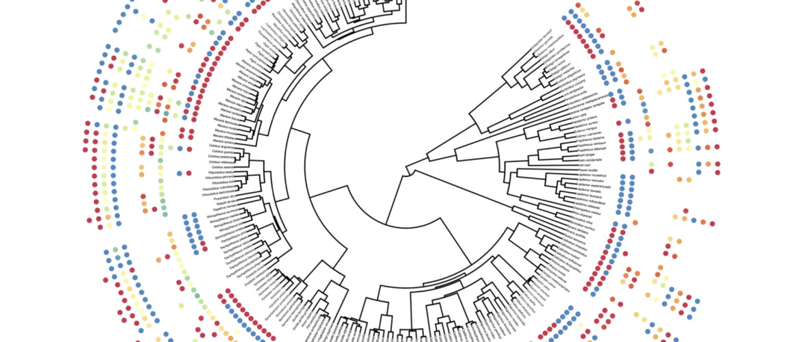

This is a course on Phylogenetic Methods: building and using trees to answer compelling questions. It was taught in Spring 2016, 2017, and 2018, and is now being taught again in Spring 2019 (Jan - April). UT Knoxville students may sign up at EEB 587. However, I encourage *anyone* to participate.

The [syllabus](syllabus.html) has information to support your learning.

You can join discussions with this [Slack invite code](https://join.slack.com/t/phylometh/shared_invite/enQtNTE5ODEzNDk5MDkyLTg0ZDQ2NTdjMjg1ZWIxZjMzNTg4MDQ0ZmU2MmFiMTY1YTNlZDcyNTg2MjBkZGY4MGQ2MWM0MDkyZGQ2MDRmMWY). See the [syllabus](syllabus.html) for how to dial in for class sessions from Zoom.

The course features instructional videos, exercises, and a textbook. All are still being refined, so check back often.

If you want to participate, please introduce yourself on Slack above, and also please fill out the form below: it helps with reporting back to NSF. The course is supported by an NSF CAREER grant to Brian O'Meara, and of course support from U of Tennessee, Knoxville.

<iframe src="https://docs.google.com/forms/d/1J18Y4h6RRUdnmg9vI9dt6CUwOdgVYMkDASTQiZfMoFc/viewform?embedded=true" width="760" height="3000" frameborder="0" marginwidth="0" marginheight="0"></iframe>
